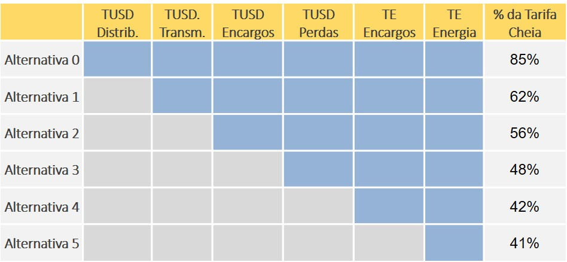

```{r, include = FALSE}
knitr::opts_chunk$set(
  collapse = TRUE,
  comment = "#>"
)
```

```{r setup, message = FALSE, warning = FALSE}
library(epe4md)
library(tidyverse)
```

O pacote `epe4md` possui diferentes funções encadeadas para realizar as projeções de difusão da Micro e Minigeração Distribuída (MMGD) no Brasil. No entanto, a função `epe4md_calcula` condensa todas as funções intermediárias e permite gerar resultados a partir da execução de apenas essa função.

## Definindo argumentos obrigatórios

Há apenas dois argumentos obrigatórios que precisam ser definidos para rodar a função `epe4md_calcula`.

Em primeiro lugar, deve-se definir o argumento `ano_base` que indica o último ano do histórico com dados disponíveis. Esse argumento está relacionado especialmente com a importação da base de dados.

Na sequência, um argumento essencial para a execução da projeção é a definição das premissas regulatórias. Ou seja, qual o modelo de compensação dos créditos de energia gerada, quando haverá mudanças no modelo, se haverá tarifas binômias para consumidores de baixa tensão, etc. Essas premissas são definidas através de um arquivo `.xlsx`. Um exemplo de entrada é apresentado a seguir, a partir de um arquivo que é instalado junto com o pacote. No entanto, o usuário pode carregar um arquivo similar a partir de suas premissas.

```{r }
premissas_regulatorias <- 
  readxl::read_xlsx(system.file("dados_premissas/2024/premissas_reg.xlsx",
                                                        package = "epe4md"))

print(premissas_regulatorias)

```

As variáveis da tabela são explicadas a seguir:

#### alternativas

Valor entre 0 e 5 que representa a forma de compensação da parcela da geração injetada na rede.

-   0: Consumidor compensa todas as componentes tarifárias.
-   1: Paga TUSD Distribuição.
-   2: Anterior + TUSD Transmissão.
-   3: Anterior + TUSD Encargos.
-   4: Anterior + TUSD Perdas.
-   5: Anterior + TE Encargos. Ou seja, compensa somente a TE Energia.

A figura a seguir ilustra as alternativas de compensação. {width="80%"}

#### p_transicao

Representa a parcela da alternativa anterior a ser paga pelo consumidor. Varia de 0 a 1, sendo 1 = 100%. Esse parâmetro permite um escalonamento da cobrança.

#### binomia

Representa a cobrança ou não de uma tarifa binômia na baixa tensão, em que as componentes TUSD Distribuição e TUSD Transmissão passariam a ser cobradas de forma fixa, não sendo passíveis de compensação. Pode ser `TRUE` ou `FALSE`.

#### demanda_g

Representa a cobrança de TUSDg para a demanda de consumidores do grupo A. Caso seja `FALSE`, é considerada a cobrança da TUSD consumo.

## Rodando o modelo 4MD

A função `epe4md_calcula` possui outros argumentos pré-definidos, que podem ser alterados caso seja de interesse do usuário. A seguir, por exemplo, iremos especificar o horizonte desejado da projeção como sendo 2035. Caso não fosse atribuído valor para esse argumento da função, o resultado iria até 2060. Para mais informações, verificar a documentação da função.

```{r, cache = TRUE, warning = FALSE, message=FALSE}
resultado <- epe4md_calcula(ano_base = 2024,
                              premissas_reg = premissas_regulatorias,
                              ano_max_resultado = 2035)
```

A saída da função traz um data frame com a projeção do número de adotantes, da capacidade instalada e da geração de energia. Os resultados estão em base mensal.

```{r, warning = FALSE, message=FALSE}
# Exemplo de resultado para o estado do RJ

resumo_potencia_rj <- resultado %>%
  filter(uf == "RJ") %>%
  group_by(ano) %>%
  summarise(adotantes_ano = sum(adotantes_mes),
            capacidade_ano_mw = sum(pot_mes_mw)) %>%
  ungroup() %>%
  mutate(adotantes_acum = cumsum(adotantes_ano),
         capacidade_acum_mw = round(cumsum(capacidade_ano_mw))) %>%
  select(ano, adotantes_acum, capacidade_acum_mw) %>%
  print()
```

O usuário pode explorar esses resultados da forma como achar melhor, embora existam algumas funções no pacote que resumam os resultados em nível nacional.

```{r, warning = FALSE, message=FALSE}
resumo_potencia <- epe4md_sumariza_resultados(resultado)

#Resultado de capacidade instalada, em GW.
print(resumo_potencia)
```

```{r, warning = FALSE, message=FALSE, fig.width=6, fig.cap="Projeção de capacidade instalada de MMGD"}

epe4md_graf_pot_acum(dados = resultado)
```

```{r, warning = FALSE, message=FALSE, fig.width=6, fig.cap="Projeção de capacidade instalada de MMGD por segmento"}

epe4md_graf_pot_segmento(dados = resultado)
```

```{r, warning = FALSE, message=FALSE, fig.width=6, fig.cap="Projeção de geração mensal de MMGD"}

epe4md_graf_geracao_mes(dados = resultado)
```
