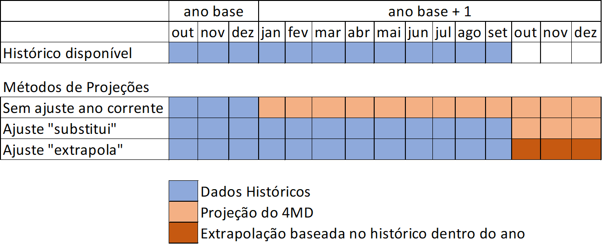

```{r, include = FALSE}
knitr::opts_chunk$set(
  collapse = TRUE,
  comment = "#>"
)
```

# Objetivo do Treinamento

Este treinamento busca fazer uma introdução ao uso do pacote *epe4md*, percorrendo as principais funções do pacote e apresentando como o usuário pode alterar parâmetros e premissas do modelo. Este treinamento não explora a construção, ou "o que está por trás" de cada função.

# O pacote epe4md

O objetivo principal do pacote epe4md é realizar projeções do mercado de Micro e Minigeração Distribuída no Brasil. O modelo 4MD traz resultados de número de adotantes, capacidade instalada, geração de energia e montante de investimentos.

Página no github: <https://github.com/EPE-GOV-BR/epe4md>

## Instalação

```{r, eval = FALSE}

devtools::install_github("EPE-GOV-BR/epe4md")

```

Observação: você precisa ter instalado o pacote "devtools" anteriormente. Caso ainda não tenha feito, instale através do seguinte código.

```{r, eval = FALSE}

install.packages("devtools")

```

## A licença

A licença do pacote pode ser verificada com o seguinte código

```{r}
packageDescription("epe4md", fields = "License")
```

A licença GPL v3 significa que programa é um software livre, podendo ser distribuído e modificado. No entanto, qualquer modificação do código original precisa ser lançada com a mesma licença GPL v3. Veja mais detalhes no seguinte link: <https://github.com/EPE-GOV-BR/epe4md/blob/main/LICENSE.md>

## Acessando as vinhetas (tutoriais)

O site do pacote possui artigos com tutoriais (inclusive este). Acesse através do seguinte link: [EPE's 4MD model to forecast the adoption of Distributed Generation • epe4md (epe-gov-br.github.io)](https://epe-gov-br.github.io/epe4md/)

# Rodando a primeira projeção

```{r, message = FALSE, warning = FALSE}
library(tidyverse)
library(epe4md)
```

A função epe4md_calcula condensa todas as funções intermediárias e permite gerar resultados a partir da execução de apenas essa função. No entanto, é preciso inicialmente definir o ano base da projeção e as premissas regulatórias (ver explicação no help da função ou no seguinte tutorial: <https://epe-gov-br.github.io/epe4md/articles/fazendo_projecoes.html>

```{r}

premissas_regulatorias <- readxl::read_xlsx(system.file("dados_premissas/2022/premissas_reg.xlsx", package = "epe4md"))

resultado <- epe4md_calcula(
  ano_base = 2022,
  premissas_reg = premissas_regulatorias,
  ano_max_resultado = 2027)
```

A partir dessa planilha de resultados, você pode explorar resultados por UF, fonte, segmento, entre outros. Isso é feito com o auxílio de funções da coleção *tidyverse.*

```{r, message = FALSE}
resumo_rj <- resultado %>%
  filter(uf == "RJ") %>%
  summarise(adotantes_ano = sum(adotantes_mes),
            capacidade_ano_mw = sum(pot_mes_mw),
            .by = c(segmento, ano))
```

Ou pode utilizar a seguinte função do pacote *epe4md* para um resumo nacional.

```{r}
resumo_br <- epe4md_sumariza_resultados(resultado)
```

# Explorando a função epe4md_calcula

As projeções do 4MD são geradas através de uma série de funções encadeadas. No entanto, a função epe4md_calcula engloba todas elas.


Todos os parâmetros default da função são apresentados abaixo. Uma explicação de cada um deles pode ser vista no help da função ou no site do pacote.

```{r, eval = FALSE}

epe4md_calcula(
  premissas_reg,
  ano_base,
  ano_max_resultado = 2060,
  altera_sistemas_existentes = FALSE,
  ano_decisao_alteracao = 2023,
  inflacao = 0.0375,
  taxa_desconto_nominal = 0.13,
  custo_reforco_rede = 200,
  ano_troca_inversor = 11,
  pagamento_disponibilidade = 0.3,
  disponibilidade_kwh_mes = 100,
  filtro_renda_domicilio = "maior_3sm",
  fator_local_comercial = "residencial",
  desconto_capex_local = 0,
  anos_desconto = 0,
  tx_cresc_grupo_a = 0,
  p_max = 0.01,
  q_max = 1,
  filtro_comercial = NA_real_,
  ajuste_ano_corrente = FALSE,
  ultimo_mes_ajuste = NA_integer_,
  metodo_ajuste = NA_character_,
  dir_dados_premissas = NA_character_
)
```

### Sobre o ajuste do ano corrente

O 4MD realiza projeções em base no histórico anual. Portanto, o modelo, originalmente, não era capaz de incorporar o histórico verificado nos primeiros meses de um ano incompleto. Para lidar com essa limitação, foram adicionados dois métodos de curto prazo.

Primeiramente o parâmetro *ajuste_ano_corrente* precisa ser alterado para *TRUE*. Na sequência, deve-se preencher o *ultimo_mes_ajuste* com o número do mês de corte (último mês com dados completos no arquivo *base_mmgd.xlsx*). Por fim, escolher o *metodo_ajuste:*

-   O método "extrapola" irá extrapolar a potência e o número de adotantes até o final do ano base + 1 com base no verificado até o *ultimo_mes_ajuste*.

-   O método "substitui" substitui a projeção até o *ultimo_mes_ajuste* e mantém o restante do ano com a projeção normal. A figura a seguir ilustra esses métodos.



Como referência, o ultimo_mes_ajuste dos estudos do PLAN são os seguintes:

-   PLAN: 10 (Outubro)

-   1a Revisão Quadrimestral: 2 (Fevereiro)

-   2a Revisão Quadrimestral: 6 (Junho)

# Reproduzindo a projeção da 1a Revisão Quadrimestral do PLAN 2023-2027

```{r}

premissas_regulatorias <- readxl::read_xlsx(system.file("dados_premissas/2022/premissas_reg.xlsx", package = "epe4md"))

projecao_1rq <- epe4md_calcula(
  premissas_reg = premissas_regulatorias,
  ano_base = 2022,
  ano_max_resultado = 2027,
  altera_sistemas_existentes = TRUE,
  ano_decisao_alteracao = 2023,
  ajuste_ano_corrente = TRUE,
  ultimo_mes_ajuste = 2,
  metodo_ajuste = "extrapola",
  filtro_comercial = 0.3,
  tx_cresc_grupo_a = -0.0073  
)

resumo_projecao_1rq <- epe4md_sumariza_resultados(projecao_1rq)
```

Para mais detalhes sobre os parâmetros utilizados, acessar a Nota Técnica Metodológica do 4MD referente à projeção da 1a Revisão Quadrimestral do PLAN 2023-2027.

# Funções Auxiliares e Adicionais

## epe4md_prepara_base

A função epe4md_prepara_base é utilizada para resumir a base de unidades de MMGD disponibilizadas pela ANEEL, deixando-a no padrão utilizado pelo 4MD. Essa função é utilizada, por exemplo, para atualizar as projeções durante as revisões quadrimestrais da carga.

[Banco de Dados de MMGD da ANEEL](https://dadosabertos.aneel.gov.br/dataset/relacao-de-empreendimentos-de-geracao-distribuida)

```{r, eval = FALSE}
base_aneel <- read_csv2("empreendimento-geracao-distribuida.csv", locale = locale(encoding = "Windows-1252"))

resumo_base <- epe4md_prepara_base(base_aneel,
                                   ano_base = 2022)
```

*Dica 1: Atente-se ao encoding. Não é raro que o csv tenha alteração no encoding. Se a leitura for feita com encoding incorreto, haverá erro ao fazer join com outras tabelas.*

*Dica 2: Alterações nos nomes das distribuidoras também geram erros. Nesse caso, é necessário atualizar o arquivo em "nomes_dist_powerbi.xlsx" nas premissas do modelo.*

## epe4md_investimentos

Esta função estima o montante de investimentos a serem realizados, a partir da projeção de capacidade.

```{r, message=FALSE}
investimentos <- epe4md_investimentos(
  resultados_mensais = projecao_1rq,
  ano_base = 2022)

resumo_investimentos <- investimentos %>% 
  group_by(ano) %>% 
  summarise(investimento_ano_bi = round(sum(investimento_ano_milhoes / 1000), 2))

print(resumo_investimentos)
```

## Gráficos

Há uma série de funções para gerar gráficos a partir dos resultados. Ver lista no [site](https://epe-gov-br.github.io/epe4md/reference/index.html). Perceba que há parâmetros que permitem alterar a cor e tamanho da fonte dos gráficos.

```{r, warning = FALSE}
epe4md_graf_pot_acum(projecao_1rq)
epe4md_graf_pot_segmento(projecao_1rq)
epe4md_graf_geracao_mes(projecao_1rq, cor = "#e0a96e", tamanho = 18)
```

## epe4md_fatores_publicacao

Esta é uma função utilizada dentro da funções que geram gráficos para formatar o nome dos segmentos. Ex "comercial_bt" para "Comercial (BT)".

## epe4md_copia_premissas

Esta função cria uma copia das planilhas de premissas do modelo em uma nova pasta. Isso facilita a alteração de premissas sem que sejam alteradas as planilhas originais.

# Conhecendo as planilhas de premissas

Para conhecer as planilhas utilizadas, em primeiro lugar, vamos criar uma cópia na pasta do seu projeto atual (destino *default* da função). Caso queira escolher um diretório diferente, o usuário pode informar através do parâmetro "destino".

```{r, eval = FALSE}
epe4md_copia_premissas(ano_base = 2022)
```

Essa função criou na raiz do projeto atual as pastas *dados_premissas/2022*, com a copia de todas as planilhas de premissas.

Uma explicação breve de cada planilha pode ser encontrada no [site do pacote](https://epe-gov-br.github.io/epe4md/articles/por_dentro_do_modelo.html).

Caso deseje alterar algum parâmetro, faça a alteração nas planilhas copiadas para o seu projeto. Na sequência, ao rodar as funções do pacote *epe4md,* informe o novo diretório através do parâmetro *dir_dados_premissas*, presente em todas as funções do pacote.

Vamos ver um exemplo, alterando a taxa de crescimento do mercado potencial.

Após copiar todas as planilhas para a pasta do projeto atual, aumentamos a taxa de crescimento anual para 4% a.a. a partir de 2024 e salvamos.

```{r, eval = FALSE}
planilha_crescimento <- readxl::read_xlsx("dados_premissas/2022/crescimento_mercado.xlsx")

planilha_crescimento <- planilha_crescimento %>% 
  mutate(taxa_crescimento_mercado = ifelse(ano > 2023,
                                           0.04,
                                           taxa_crescimento_mercado))

writexl::write_xlsx(planilha_crescimento, "dados_premissas/2022/crescimento_mercado.xlsx")
```

Agora vamos fazer nova projeção, passando o caminho da nova pasta de premissas (perceba o último parâmetro).

```{r, eval = FALSE}
resultado_crescimento <- epe4md_calcula(
  premissas_reg = premissas_regulatorias,
  ano_base = 2022,
  ano_max_resultado = 2027,
  altera_sistemas_existentes = TRUE,
  ano_decisao_alteracao = 2023,
  ajuste_ano_corrente = TRUE,
  ultimo_mes_ajuste = 2,
  metodo_ajuste = "extrapola",
  filtro_comercial = 0.3,
  tx_cresc_grupo_a = -0.0073,
  dir_dados_premissas = "dados_premissas/2022"
  )

resumo_crescimento <- epe4md_sumariza_resultados(resultado_crescimento)
```

Portanto, há liberdade para o usuário alterar outras planilhas de premissas para gerar novos resultados.

# Realizando projeções por partes

Caso o usuário tenha interesse em entender melhor a construção dos resultados, pode gerar as projeções passo a passo, utilizando as funções intermediárias.


## mercado_potencial

O primeiro passo é calcular o mercado potencial inicial para adotar a tecnologia. Observe os parâmetros da função. Além da definição do ano base, há os filtros residencial e comercial, que têm grande impacto no tamanho do mercado potencial, e a definição da taxa de crescimento do mercado potencial dos consumidores do Grupo A (Alta Tensão).

```{r}
mercado <- epe4md_mercado_potencial(
  ano_base = 2022,
  filtro_renda_domicilio = "maior_3sm",
  filtro_comercial = 0.3,
  tx_cresc_grupo_a = -0.0073)
```

Esta função resulta um em uma lista com dois data.frames. "consumidores" possui o mercado potencial incial. "consumidores_totais" possui dados de mercado total.

```{r}
consumidores <- mercado$consumidores
```

## casos_payback

Na sequência, é necessário calcular o payback para cada caso. Para isso, primeiro é gerado um dataframe com uma lista de casos para cálculo de payback. Exemplo, 5 segmento de mercado, 54 distribuidoras, entre o ano de 2013 e 2027 (15 anos) equivalem a 4050 combinações. O dataframe gerado possui uma linha para cada caso, com os parâmetros necessários para gerar o cálculo de payback posteriormente (CAPEX, OPEX, fator de autoconsumo, ano de troca do inversor, etc.)

```{r}
casos <- epe4md_casos_payback(
  ano_base = 2022,
  ano_max_resultado = 2027
)
```

## payback

Na sequência, é elaborado um fluxo de caixa para cada caso e são calculas as métricas financeiras de payback e TIR.

```{r}
payback <- epe4md_payback(
  casos_payback = casos,
  premissas_reg = premissas_regulatorias,
  ano_base = 2022,
  altera_sistemas_existentes = TRUE,
  ano_decisao_alteracao = 2023)
```

## calibra_curva_s

Neste passo é calculado o mercado potencial final ao unir o mercado potencial inicial com as estimativas de payback. Adicionalmente, comparando esse mercado com os dados históricos até o ano base, são estimadas as curvas S de difusão, para cada distribuidora e cada segmento.

```{r}
mercado_calibrado <- epe4md_calibra_curva_s(
  resultado_payback = payback,
  consumidores = mercado,
  ano_base = 2022,
  ano_max_resultado = 2027,
  p_max = 0.01,
  q_max = 1
)
```

## proj_adotantes

A partir do mercado potencial e da taxa de adoção F(t), é calculado o número de adotantes anual. Também é feita a abertura de adotantes por fonte.

```{r}
adotantes <- epe4md_proj_adotantes(
  casos_otimizados = mercado_calibrado,
  consumidores = mercado,
  ano_base = 2022
)

dados_adotantes <- adotantes$proj_adotantes
```

O resultado é uma lista com dois data.frames. "proj_adotantes" possui os resultados da projeção de adotantes de micro e minigeração distribuída. "part_adotantes" possui o resultado em termos de participação do número de adotantes frente ao total de unidades consumidoras.

## proj_potencia

O número de adotantes é então multiplicado pela potência média histórica por fonte, segmento e distribuidora para se obter a estimativa da capacidade instalada.

```{r}
potencia <- epe4md_proj_potencia(
  lista_adotantes = adotantes,
  ano_base = 2022
)

dados_potencia <- potencia$proj_potencia
```

## proj_mensal

Nesta etapa, a projeção anual é aberta por mês.

```{r}
mensal <- epe4md_proj_mensal(
  lista_potencia = potencia,
  ano_base = 2022,
  ano_max_resultado = 2027,
  ajuste_ano_corrente = TRUE,
  ultimo_mes_ajuste = 2,
  metodo_ajuste = "extrapola"
)
```

## proj_geracao

Finalmente, esta função estima a geração de energia a partir da capacidade instalada mensal. Além da geração, o dataframe mantém os dados de adotantes e capacidade instalada.

```{r, warning=FALSE}
geracao <- epe4md_proj_geracao(
  proj_mensal = mensal,
  ano_base = 2022
)

resumo_partes_br <- epe4md_sumariza_resultados(geracao)

dplyr::all_equal(resumo_projecao_1rq, resumo_partes_br)
```

Como é possível perceber, o resultado da função *all_equal* indica que a execução por partes teve o mesmo resultado que a função *epe4m4_calcula*.
